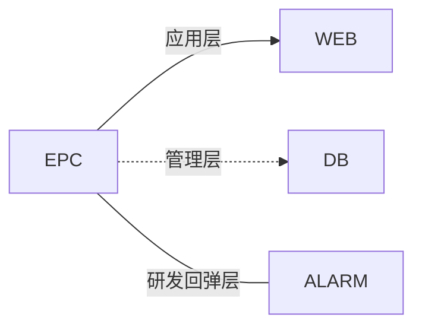
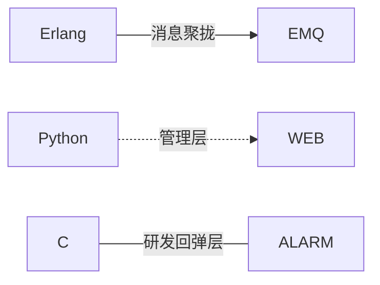

 

<h2 align="center">Small as the idea is, it is important to realize it</h2>

Simple and convenient as python, lightweight and fast is a martial art for the Internet of things world.

 

 

> ##### EPC模型：`Erlang` + `Python` + `C` 

